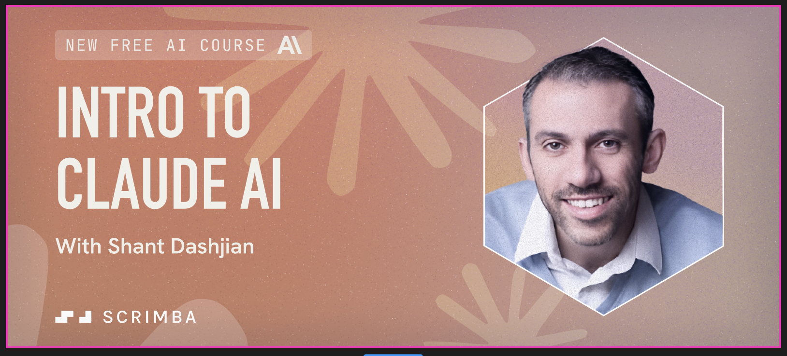

# Intro to Claude AI Course
My Intro to Claude AI course published on the Scrimba learning platform as well as on Coursera.

## In This Document:
  - [Course URLs](#course-urls)
  - [Source Code Repositories](#source-code-repositories)
  - [About the Course](#about-the-course)
  - [What You Will Learn](#what-you-will-learn)
  - [Prerequisites](#prerequisites)

## Course URLs
1. [Intro to Claude AI course on Scrimba](https://v2.scrimba.com/claude-ai-c09gsmkso3)
2. [Intro to Claude AI course on Coursera](https://www.coursera.org/learn/intro-to-claude-ai)

## Source Code Repositories:
In the course, students build the following apps:
1. [🗞️ Text Summarizer](https://github.com/shantdashjian/the-summarizer)
2. [🖼️ Image Describer](https://github.com/shantdashjian/the-describer)
   
## About the Course
In this course, you will get to know Claude, Anthropic's powerful large language model. Through a series of fun coding challenges, you'll build practical skills and learn how to harness Claude's capabilities effectively in a variety of projects.

Whatever exciting applications you hope to build, this course will give you the tools to bring your ideas to life with Claude.

You'll start by getting to know Claude and obtaining your Anthropic API key. Then, you'll jump right into conversations with Claude, learning how to craft effective prompts for various tasks. As you progress, you'll tackle two projects: a text summarizer and an image describer, putting your new skills to the test.

Throughout the course, you'll also build valuable skills in API usage, error handling, and cloud deployment.

As an added bonus, you'll also discover Scrimba's template feature, expanding your developer toolkit for future projects.

## What You Will Learn
1. Understand Claude's capabilities and how it fits into the AI landscape.
2. Describe Anthropic's commitment to AI safety and ethics.
3. Build two practical projects: a text summarizer and an image describer.
4. Control Claude's output using Prompt Engineering.
5. Handle API interactions and error management
6. Deploy your Claude-powered projects to the cloud.

## Prerequisites:
1. HTML.
2. CSS.
3. Intermediate JavaScript. You need to know how to work with APIs and fetch data.
   

[Up](README.md)

